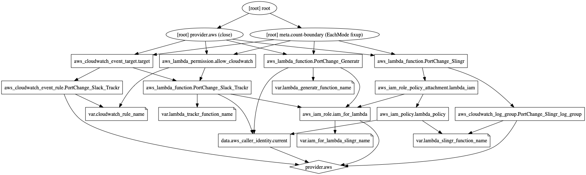

# Info
Creates the `PortChange_Slingr`, `PortChange_Generatr` and `PortChange_Slack_Trackr` lambda functions, corresponding needed IAM roles and a Cloudwatch rule that serves to invoke PortChange_Slack_Trackr.

# How to run
Just run
- add AWS credentials in a new file named `subscription.tf` . the `subscription.tf.sample` file is provided as an example.
- run `terraform init`.
- run `terraform apply`.
- cleanup after finishing tests with `terraform destroy`.

## Resources that will be created
Graph generated with `terraform graph | dot -Tpng > graph.png`

